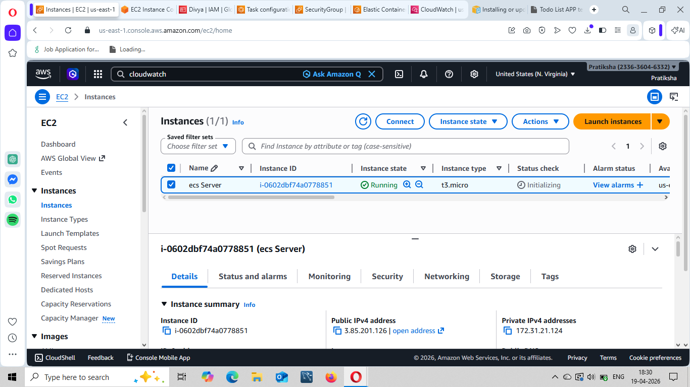
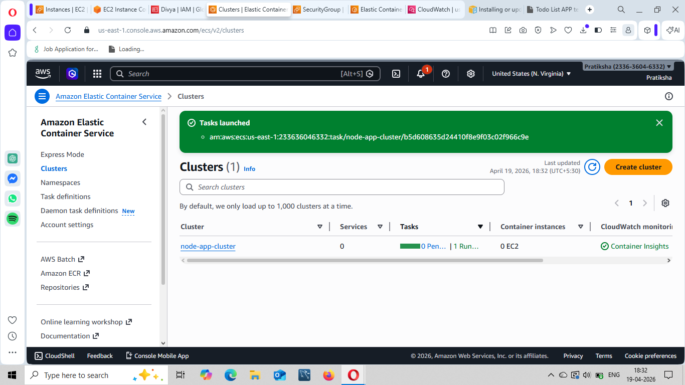
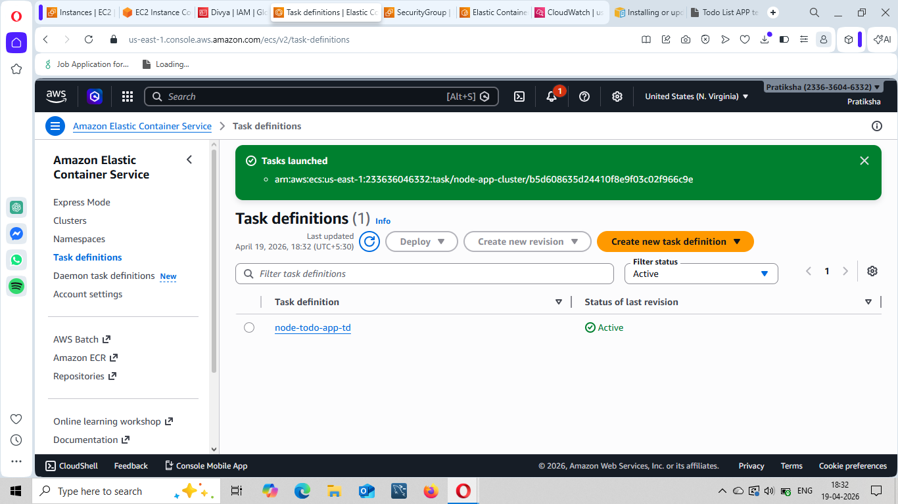
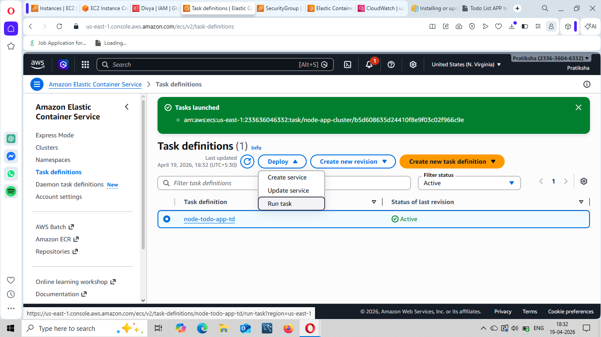
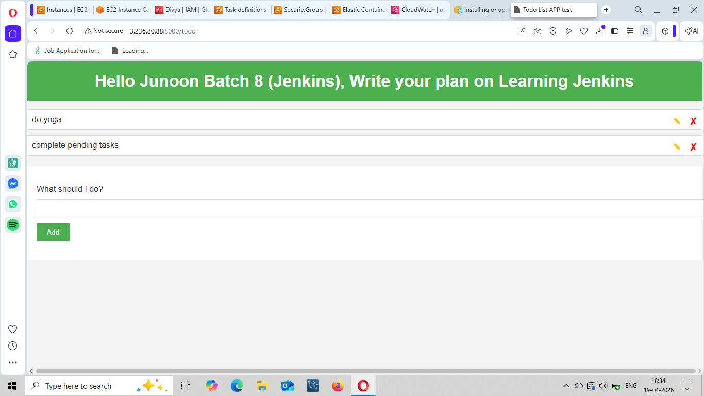

# 🚀 End-to-End DevOps Pipeline: Node.js App Deployment on AWS ECS (Fargate)

## 📌 Project Overview

This project demonstrates an end-to-end DevOps workflow where a Node.js application is containerized using Docker, pushed to AWS ECR, and deployed on AWS ECS using Fargate (serverless). Application logs are monitored using CloudWatch.

---

## 🧰 Tech Stack

* Node.js
* Docker
* AWS EC2
* AWS ECR
* AWS ECS (Fargate)
* AWS CloudWatch
* IAM

---

## 🏗️ Architecture Workflow

1. Clone application code from GitHub to EC2
2. Build Docker image on EC2
3. Push Docker image to Amazon ECR
4. Create ECS cluster using Fargate
5. Define Task Definition with container configuration
6. Deploy container in ECS cluster
7. Access application via public IP
8. Monitor logs using CloudWatch

---

## ⚙️ Step-by-Step Implementation

### 1️⃣ Launch EC2 Instance

* Launch Ubuntu EC2 instance
* Connect using SSH

---

### 2️⃣ Clone GitHub Repository

```bash
git clone <your-repo-url>
ls
cd <project-folder>
```

---

### 3️⃣ Install Docker

```bash
sudo apt update
sudo apt install docker.io -y
docker ps
```

#### Fix Permission Issue

```bash
sudo usermod -aG docker ubuntu
sudo reboot
```

---

### 4️⃣ Install AWS CLI

* Download AWS CLI from official website
* Run installation commands

```bash
aws configure
```

> ⚠️ Ensure EC2 has IAM Role with ECR permissions 

---

### 5️⃣ Create ECR Repository

* Go to AWS ECR
* Create repository: `node-app`
* Copy “push commands”

---

### 6️⃣ Build & Push Docker Image

```bash
# Authenticate Docker to ECR
<login-command-from-ecr>

# Build image
docker build -t node-app .

# Tag image
docker tag node-app:latest <ecr-repo-url>

# Push image
docker push <ecr-repo-url>
```

---

### 7️⃣ Create ECS Cluster

* Go to ECS → Create Cluster
* Name: `node-app-cluster`
* Select **Fargate (serverless)**
* Enable Container Insights


---

### 8️⃣ Create Task Definition

* Launch type: Fargate
* Task name: `node-todo-app-td`
* Task execution role: `ecsTaskExecutionRole`


#### Container Configuration:

* Container name: `node-container`
* Image: `<ECR Image URL>`
* Port mapping: `8000`

#### Logging:

* Log driver: `awslogs`
* Log group: `/ecs/node-app`

---

### 9️⃣ Run Task

* Go to Task Definition → Deploy → Run Task
* Select cluster: `node-app-cluster`
* Enable Public IP

---

### 🔟 Access Application

* Go to running task
* Copy Public IP

```bash
http://<public-ip>:8000
```

---

### 1️⃣1️⃣ Configure Security Group

If app not accessible:

* Edit inbound rules
* Allow port `8000`

---

### 1️⃣2️⃣ Monitor Logs

* Go to CloudWatch → Log Groups
* Open `/ecs/node-app`
* View application logs

---

## ⚠️ Challenges Faced

* Docker permission denied issue
* ECR authentication errors
* IAM permission misconfiguration
* ECS task not accessible due to security group

---

## ✅ Key Learnings

* Containerizing applications using Docker
* Using AWS ECR as container registry
* Deploying containers using ECS Fargate
* Managing IAM roles securely
* Monitoring logs using CloudWatch

---

---

## 🙌 Conclusion

Successfully built and deployed a containerized Node.js application using AWS DevOps services, demonstrating a complete workflow from code to production.


---
